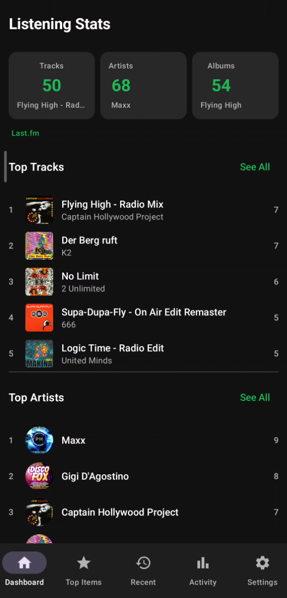
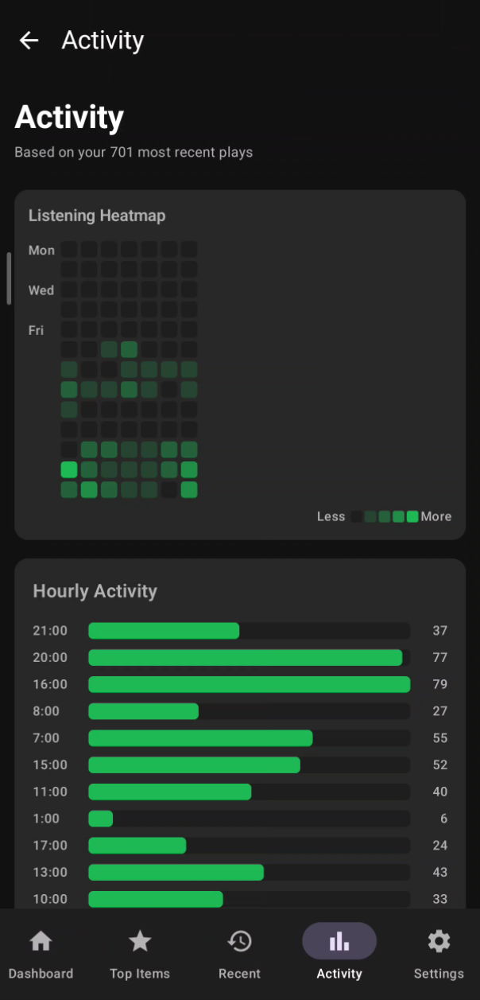

# Listening Stats Android Concept

A personal Android app that visualizes music listening statistics from **Last.fm**, **stats.fm**, and **Deezer** — built as a learning project to improve Kotlin/Jetpack Compose skills.





## Features

- **Providers:** Last.fm (primary), stats.fm (heatmap data), Deezer (album art fallback)
- **Top lists:** tracks, artists, albums with play counts and time range filters
- **Activity:** hourly patterns, weekday views, calendar heatmap
- **Dashboard:** summary cards, top items, recently played with album art
- **Export:** share cards from your stats

## Supported Devices

- **Android 8.0 (API 26)** and above
- arm64-v8a, armeabi-v7a, x86_64

## Download

Grab the latest APK from [Releases](https://github.com/Death-Watcher/listening-stats-android-concept/releases).

## Build from Source

```bash
git clone https://github.com/Death-Watcher/listening-stats-android-concept.git
cd listening-stats-android-concept
export JAVA_HOME=/path/to/jdk17
export ANDROID_HOME=/path/to/android-sdk
./gradlew assembleDebug
```

The APK will be at `app/build/outputs/apk/debug/app-debug.apk`.

## Requirements

- **Last.fm account** + [API key](https://www.last.fm/api)
- **stats.fm account** (optional, provides additional heatmap data)

## Concept

This is a **learning / portfolio project**, not a production app. The goal was to explore:

- Jetpack Compose UI + Material3 design system
- Retrofit + kotlinx.serialization for API clients
- ViewModel + StateFlow + coroutines architecture
- Room caching and Coil image loading
- Adaptive icons and Android theming

## APIs Used

- [Last.fm API](https://www.last.fm/api) – play counts, album art, artist names
- [Deezer API](https://developers.deezer.com/api) – album art fallback
- [stats.fm API](https://stats.fm/api) – stream timestamps (heatmap only)

## License

MIT
